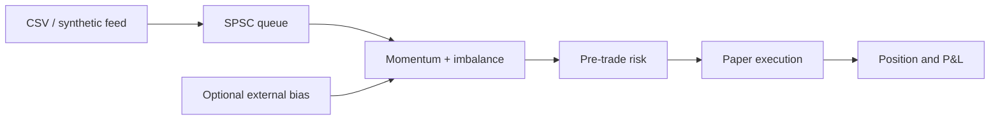
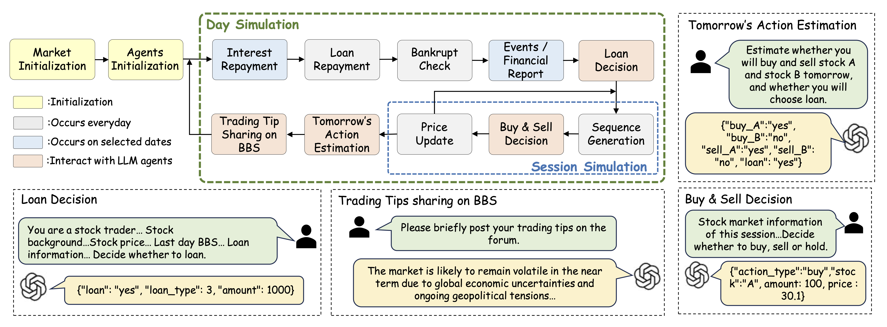

# Trading Project

A research-focused trading system with a dependency-free C++20 execution path
for deterministic market replay, strategy evaluation, risk checks, paper fills,
parameter search, and latency measurement. The supported implementation is the
low-latency engine described below.

This repository uses
[MingyuJ666/Stockagent](https://github.com/MingyuJ666/Stockagent) as its
research starting point. The original Python/LLM simulation is retained as
legacy reference code and remains attributed to its authors.

## Low-latency C++20 trading engine

StockAgent now includes a separate C++20 research and paper-trading engine under
[`cpp/`](cpp/). It keeps market-data handling, strategy evaluation, pre-trade
risk, paper execution, and position/P&L accounting on a reproducible,
low-allocation path. The legacy Python/LLM research code is preserved, but it is
not wired into the C++ engine. A bounded external bias can instead be supplied
manually at startup; a timestamped Python/IPC adapter is future work.

```bash
# Requires CMake 3.20+ and a C++20 compiler
make build
make test
make run
make optimize
make bench
```

The included strategy combines EMA momentum with top-of-book imbalance. Prices
use integer ticks; events can come from a reproducible synthetic feed or CSV
replay; risk limits are applied before every order. The bounded SPSC queue,
engine, tests, replay CLI, train/holdout parameter optimizer, and benchmark have
no third-party C++ dependencies.



See [the low-latency engine guide](docs/low-latency-engine.md) for the data
model, architecture, risk boundary, benchmark methodology, and integration
guidance.

> **Research use only.** The C++ engine does not connect to a broker or place
> live orders. Backtest and simulation results are not investment advice and do
> not guarantee future returns.

## Link
ARXIV LINK: https://arxiv.org/pdf/2407.18957

Accepted by Transactions on Intelligent Systems and Technology (ACM TIST)
## Architecture


The Workflow of Trading Simulation Flow. There are four Phases, namely **Initial Phase**, **Trading Phase**, **Post-Trading Phase** and **Special Events Phase**. In the Post-Trading Phase, Daily events and Quarterly events occur with daily and quarterly frequency respectively. A Specific Events Phase is an event that occurs randomly and acts on a random trading day.

## Legacy Python quick start (unverified)

> The instructions below are preserved from the original research project.
> That runtime is not covered by the new C++ CI and currently needs additional
> dependency/output-path work before it should be treated as a clean,
> reproducible setup. The supported path added here is the C++ workflow above.

#### Environment

```
conda create --name stockagent python=3.9
conda activate stockagent

git clone https://github.com/dhh1995/PromptCoder
cd PromptCoder
pip install -e .
cd ..

git clone <This Github Project>
cd Stockagent
pip install -r requirements.txt
```

#### API keys

Use GPTs as agent LLM:

```
export OPENAI_API_KEY=YOUR_OPENAI_API_KEY
```

Use Gemini as agent LLM:

```
export GOOGLE_API_KEY=YOUR_GEMINI_API_KEY
```

#### Start simulation

You can choose a basic LLM and start simulation in one line:

```
python main.py --model MODEL_NAME
```

We set gemini-pro for default LLM.

#### About ’procoder‘

Here we use the: https://github.com/dhh1995/PromptCoder.git this tool, please download after its installation.

#### Citation
If you find the code is valuable, please use this citation.
```
@article{zhang2024ai,
  title={When ai meets finance (stockagent): Large language model-based stock trading in simulated real-world environments},
  author={Zhang, Chong and Liu, Xinyi and Zhang, Zhongmou and Jin, Mingyu and Li, Lingyao and Wang, Zhenting and Hua, Wenyue and Shu, Dong and Zhu, Suiyuan and Jin, Xiaobo and others},
  journal={arXiv preprint arXiv:2407.18957},
  year={2024}
}
```
