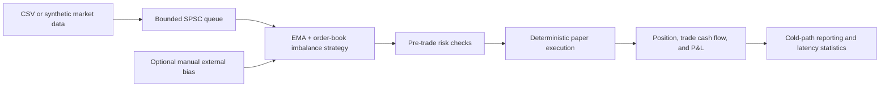

# Low-latency C++ engine

The C++20 subsystem is a reproducible research and paper-trading engine. It is
kept separate from the legacy Python/LLM simulation so C++ can own the
latency-sensitive market-data, strategy, risk, and execution path.

It does **not** connect to a broker or submit live orders. Results from replay or
synthetic data are not evidence of future profitability.

## Architecture



The hot path is intentionally small:

1. Accept a validated top-of-book event.
2. Update fixed-size strategy state.
3. Produce at most one desired order.
4. Apply pre-trade limits.
5. Fill an accepted paper order at the displayed quote.
6. Update the position and P&L ledger.

CSV parsing, console output, dynamic percentile storage, and LLM/API work stay
outside that path.

## Numeric and concurrency model

- Prices are signed 64-bit integer ticks, not floating-point currency.
- Quantities and positions are signed 64-bit integers.
- Timestamps are monotonic nanoseconds supplied by the feed.
- The feed/engine handoff uses a fixed-capacity single-producer,
  single-consumer ring buffer.
- The queue uses acquire/release ordering and cache-line separation for its
  producer and consumer indices.
- No architecture-specific cycle counter, `-march=native`, or `-ffast-math` is
  required, so the same code builds on x64 and ARM64.

The queue is SPSC by design. Using multiple producers or consumers is outside
its contract. External-bias and kill-switch updates are atomic. For a
reproducible replay, apply those controls between batches; a concurrently
scheduled update is race-free but may be observed on a different tick. Ledger
and statistics snapshots belong to the engine thread and must be read only
after processing pauses.

EMA state and scores use bounded IEEE-754 `double` values. Replays are
deterministic within the same compiler/build environment; decisions exactly on
a threshold are not promised to be bit-for-bit identical across every
architecture and compiler.

## Strategy

The included strategy combines two signals:

```text
momentum = normalized(fast EMA - slow EMA)
imbalance = (bid size - ask size) / (bid size + ask size)
score = momentum_weight * momentum
      + imbalance_weight * imbalance
      + external_bias_weight * external_bias
```

The score must cross a configurable entry threshold before the engine changes
position. A separate exit threshold reduces rapid position flipping. The
external bias is optional and bounded to `[-1, 1]`. The CLI accepts one static
startup value. No live Python or IPC adapter is included.

This is a transparent baseline, not a universally optimal strategy. Parameters
must be selected on training data and evaluated on unseen data with fees,
slippage, and realistic latency assumptions.

The included `stockagent_strategy_optimizer` performs a bounded grid search on
the training segment only and reports a separate holdout segment:

```bash
make optimize
make optimize OPTIMIZE_ARGS='--csv path/to/ordered_ticks.csv'
```

Its objective uses a fee-adjusted liquidation-equity curve: each actual fill is
charged, open inventory is valued at the executable side of the spread with a
hypothetical closing fee, and maximum drawdown is subtracted. Validation EMA
state is warmed with the immediately preceding no-trade context. The selected
result is merely the best candidate in that search space on the supplied
training data. The synthetic feed intentionally repeats designed regimes, so it
is a pipeline demonstration rather than credible evidence of generalization.

## Risk boundary

Every proposed order is rejected unless it passes all configured controls,
including:

- valid, non-crossed, positive top-of-book quotes;
- sufficient displayed quantity for a full fill;
- maximum order quantity;
- maximum absolute position;
- maximum gross notional;
- maximum realized/unrealized loss;
- stale-event and monotonic-timestamp checks;
- checked accounting arithmetic with an explicit fail-closed fault; and
- an explicit kill switch.

Risk checks happen before paper execution. Rejection counters are included in
the final report so a strategy cannot silently trade through its limits.
Position-reducing orders remain permitted after a loss limit or kill switch so
the engine is not trapped in exposure. A large timestamp discontinuity is
rejected once and adopted as the new ordered baseline. An arithmetic fault
halts further strategy processing and requires a new engine instance.

## Execution and P&L model

The included gateway is deliberately deterministic:

- buys fill at the displayed ask;
- sells fill at the displayed bid;
- the requested quantity either fills completely or is rejected;
- there is no hidden liquidity or partial-fill model;
- cumulative trade cash flow, exact signed position cost, average entry price,
  realized P&L, and mark-to-market P&L are updated transactionally within the
  single engine thread.

This conservative spread-crossing model makes tests reproducible. A more
realistic simulator can implement the same gateway boundary with queue
position, partial fills, fees, and configurable slippage.

## Build and validate

```bash
make build
make test
make run
make optimize
make bench
make sanitize
```

CMake 3.20+ and a C++20 compiler are required. Build directories default to
`build/cpp` and are ignored by Git.

The benchmark uses an uninstrumented pass for throughput, then a separate
sampled pass for fill and no-fill latency distributions. It calibrates and
reports the median back-to-back `std::chrono::steady_clock` baseline but does
not subtract it from samples. Raw sub-50-nanosecond results may mostly reflect
timer quantization. Results are meaningful only when compared on the same
isolated host, compiler, build type, and CPU-power configuration.

## Future Python/LLM integration pattern

No Python/IPC bridge is included. A future adapter should stay asynchronous and
coarse-grained:

1. Run a validated Python research process outside the C++ process.
2. Normalize their aggregate view to a bounded value in `[-1, 1]`.
3. Submit a timestamped or sequenced control event to the C++ engine between
   replay batches or at a much lower frequency than market-data events.
4. Record the bias value and timestamp with every experiment for
   reproducibility.

Do not call an LLM, parse JSON, write Excel files, or log to a console from the
market-data callback.

## Path to live connectivity

A live deployment would still need production-grade feed and broker adapters,
authentication, order acknowledgements, cancel/replace state, recovery,
persistent audit logs, clock synchronization, fees, venue rules, monitoring,
and independent risk controls. Those concerns are intentionally not simulated
as if they were production-ready here.
